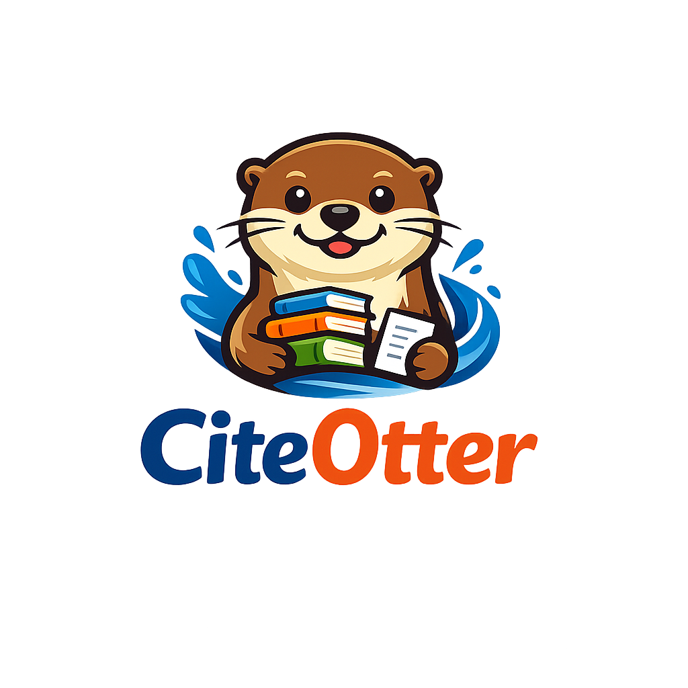

  
  
  
  

# Cite-Otter

Cite-Otter is a Rust re-implementation of the Ruby [`AnyStyle`](tmp/anystyle) reference parser. The project retraces AnyStyle’s parser/finder/training workflows while embracing Rust idioms for parsing, modeling, and CLI tooling.

## What’s here

- **Reference alignment**: `REFERENCE.md` records the Ruby repo structure, dependencies, build/training surfaces, and validation steps we aim to mirror.
- **Implementation strategy**: `ROADMAP.md` breaks the work into SemVer milestones (`v0.1.0` → `v1.0.0`), prioritizing CLI/parser foundations & tests first, then training/finder logic, and finally documentation + parity polish.
- **Cargo scaffold**: `Cargo.toml`, `src/`, and Rust tooling files are ready for the first wave of parser and CLI work.

## Getting started

1. Install Rust (2024 edition) per `rust-toolchain.toml`.
2. Build/test via `cargo build` / `cargo test`.
3. Use `ROADMAP.md` to decide which phase you are tackling and refer to `REFERENCE.md` for Ruby behaviors to match.
4. The CLI `parse` command now accepts `--format json|bibtex|csl` so you can request multiple export styles from the same parsing pipeline.

## Goals beyond the docs

- Preserve AnyStyle’s CLI surface (`parse`, `find`, `train`, `check`, `delta`) and repo layout so users can migrate workflows.
- Build a parser/finder module suite with pluggable adapters that can be reused both as a CLI and as a library.
- Keep documentation, tests, and release notes synchronized with the roadmap’s SemVer rhythm.

## Recent progress

- **Parser precision & metadata coverage** – The parser now builds `FieldTokens` for each reference line so token tagging matches the same author/title/location/ publisher/date/pages data it extracts; additional helpers also populate `container-title`, `volume`, `issue`, `genre`, and `edition` fields and surface `scripts`/`language` from the reference string. The new heuristics live in `src/parser.rs` and keep `tests/reference_parser.rs` green.
- **Training/finder parity** – The training workflow now records the normalized finder sequences in `target/models/finder-model.json`, and the `find` command loads that model so detected segments are matched against previously trained signatures before falling back to the raw segments; `tests/reference_training.rs` still exercises the same train/check/delta lifecycle.

## References

- `tmp/anystyle` – Ruby source and training data that inspired the Rust port.
- `docs/migration/structure.md` – Migration template that guided `REFERENCE.md` and overall planning.
